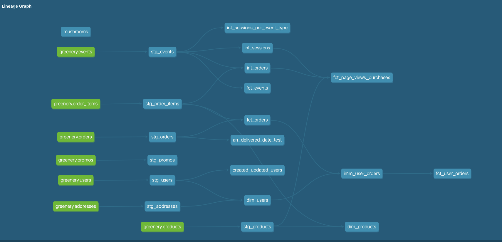

## Week 4

### Part 1 Models 

*1a. How are our users moving through the funnel?*

 **Answer:**

Query:
```ruby

```

*1b. What are our largest dropoff points?*


 **Answer:**


Query:
```ruby

```

*2. If your organization is using dbt, what are 1-2 things you might do differently / recommend to your organization based on learning from this course?*

*3. After learning about the various options for dbt deployment and seeing your final dbt project, how would you go about setting up a production/scheduled dbt run of your project in an ideal state? You don’t have to actually set anything up - just jot down what you would do and why and post in a README file.*

*5. Show your DAG*

**DAG:**

